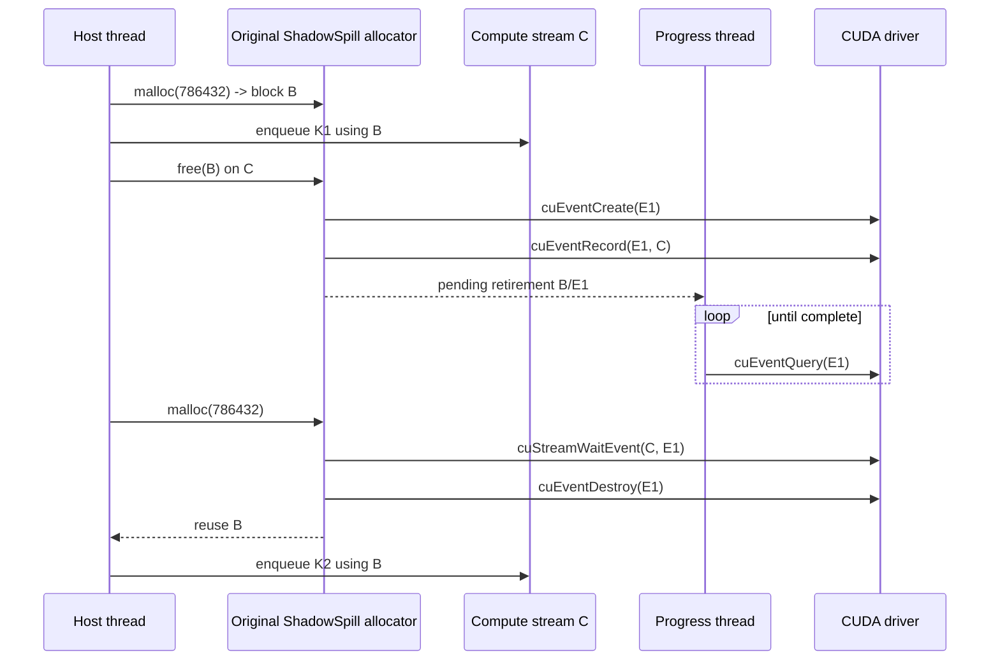
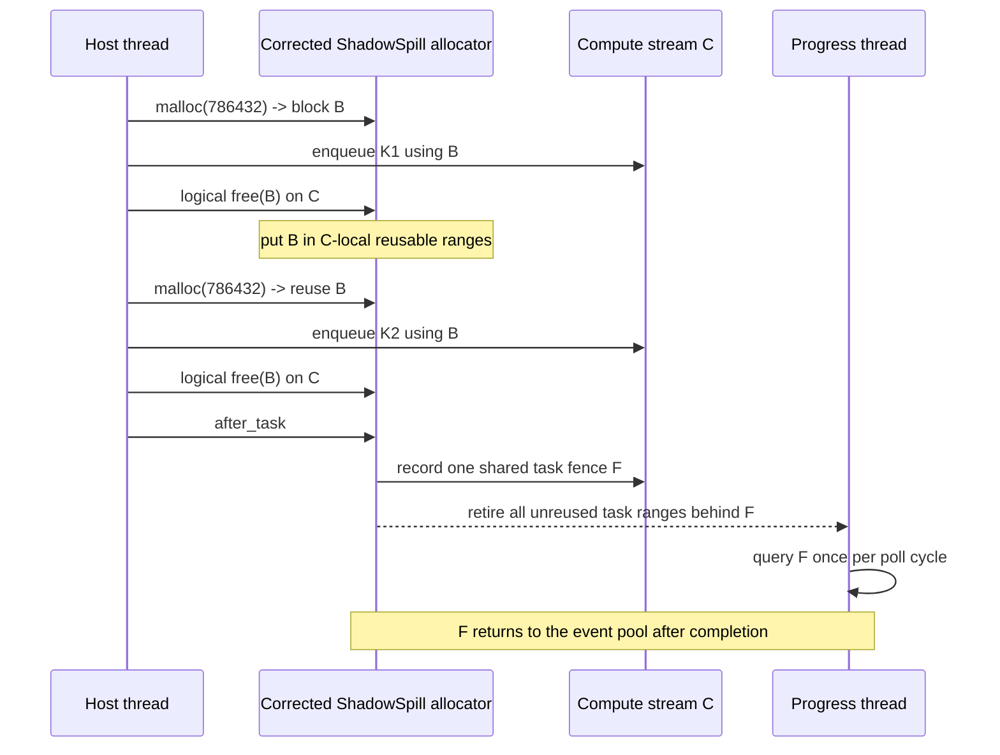
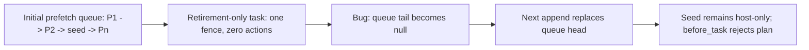

# The Anonymous-Temporary Retirement Storm

## Purpose

This document describes a real performance failure in which numerically
identical compiled PyTorch work ran more than two orders of magnitude slower
with ShadowSpill's first slab allocator than with PyTorch's standard CUDA
caching allocator. The failure was not caused by offload bandwidth,
recomputation, graph lowering, or different arithmetic. It was caused by
applying full cross-stream retirement machinery to every short-lived tensor.

The incident establishes a general allocator rule:

> A tensor freed on the same CUDA stream that used it can be reused on that
> stream immediately. CUDA stream order is already the dependency. Creating,
> recording, polling, and destroying one CUDA event per free is unnecessary
> and can dominate allocation-dense PyTorch code.

The correction has now passed a complete five-step Qwen qualification plus a
two-step checkpoint replay. The allocator hot path, the profiling boundary,
and event creation policy all had to agree: fixing only the measurement would
have hidden the runtime defect, while fixing only runtime execution would have
left PressureFit calibrated with fictitious multi-second tasks.

The example is the pure-PyTorch Qwen 3.5 numerical qualification. Its linear
attention uses an explicit recurrent reference implementation behind a normal
registered PyTorch custom operation. This implementation is intentionally
allocation-dense, which made the allocator defect unusually visible. The same
defect applies to arbitrary PyTorch graphs that create many temporaries.

## Workload and comparison

The model is the approximately one-billion-parameter pure-PyTorch Qwen 3.5
qualification configuration:

| Property | Value |
|---|---:|
| Decoder layers | 8 |
| Hidden width | 1,536 |
| Feed-forward width | 4,608 |
| Vocabulary | 248,320 |
| Layer schedule | Three linear-attention layers followed by one full-attention layer |
| Gradient-accumulation microbatches | 2 |
| Microbatch token shapes | 1 x 64 and 1 x 96 |
| Public device budget | 10 GiB |
| Optimizer | `mlops.optim.AdamW` |
| Reference compilation | Whole objective, `torch.compile(fullgraph=True, dynamic=False)` |
| ShadowSpill compilation | Structurally unique AOT/Inductor stage ABIs |

Both paths execute the same registered operations and CUDA arithmetic. The
reference uses PyTorch's standard allocator. ShadowSpill uses one conventional
CUDA slab and services PyTorch's pluggable allocator callbacks itself.

## Observed behavior

### Standard PyTorch allocator

The first reference step includes the whole-objective Inductor compilation.
The following four steps are the steady-state execution comparison:

| Step | Wall time |
|---:|---:|
| 1, compile plus execute | 51.775 s |
| 2 | 0.300 s |
| 3 | 0.296 s |
| 4 | 0.297 s |
| 5 | 0.297 s |
| **Median of steps 2--5** | **0.297 s** |

This proves that the recurrent operation and its backward are capable of
running quickly on the tested CUDA geometry.

### Original ShadowSpill slab allocator

ShadowSpill profiles every unique structural task ABI with CUDA events. The 43
unique profile medians summed to **39.199 seconds**. PressureFit consequently
predicted a complete step makespan of **42.567 seconds**. Relative to the
0.297-second standard-allocator median, the predicted steady-state slowdown was
approximately **143x**.

The process symptoms matched a host-side allocator storm:

| Signal | Observation |
|---|---|
| Main Python process | Approximately 100--125% CPU |
| GPU SM utilization during a sample | Approximately 0--2% |
| GPU memory | Slab resident, approximately 9.8 GiB process use |
| Sampled stack | Inside `qwen35_delta_rule_backward` while issuing ordinary CUDA tensor operations |
| PressureFit | Already complete; cached lookup later took 0.030 s |
| Failure mode | Severe dispatch gaps, not an OOM or numerical error |

The CUDA event measurement includes gaps in the GPU stream timeline when the
host cannot enqueue the next kernel promptly. It therefore correctly measured
the end-to-end task cost even though the underlying kernels themselves were
not slow.

## Quantitative allocator evidence

The profile trace records each `malloc` and logical `free`. The most expensive
structural ABIs were Qwen linear-attention/objective forward or backward stages
for the 64- and 96-token positions. Names below describe their role; the cache
digest is included only to make the raw evidence reproducible.

| Rank | Structural task role | Time | Trace events | Allocations | Frees | Same-range reuses | Largest request | Cache digest prefix |
|---:|---|---:|---:|---:|---:|---:|---:|---|
| 1 | 96-token linear-attention backward variant | 4.936 s | 5,029 | 2,521 | 2,508 | 1,438 | 13.50 MiB | `ebfccc9c` |
| 2 | 96-token objective/backward variant with output-head workspace | 4.913 s | 5,035 | 2,524 | 2,511 | 660 | 1,455.00 MiB | `78ba95a3` |
| 3 | 64-token linear-attention backward variant | 4.111 s | 3,431 | 1,722 | 1,709 | 810 | 13.50 MiB | `efe3bd2c` |
| 4 | 64-token objective/backward variant with output-head workspace | 3.677 s | 3,433 | 1,723 | 1,710 | 357 | 1,455.00 MiB | `9f44cec9` |
| 5 | Alternate 64-token linear-attention backward variant | 3.074 s | 3,431 | 1,722 | 1,709 | 949 | 13.50 MiB | `e2851a6a` |
| 6 | Alternate 96-token objective/backward variant | 3.007 s | 5,035 | 2,524 | 2,511 | 341 | 1,455.00 MiB | `4bec3a46` |

Across all 43 unique profiles:

| Quantity | Total |
|---|---:|
| Allocation/free trace events | 50,028 |
| Allocation callbacks represented | 25,576 |
| Logical free callbacks represented | 24,452 |
| Sum of unique-task median times | 39.199 s |

The storm is not mainly about the few large requests. A 96-token recurrence
stage repeatedly creates 2,304-byte, 6,144-byte, 147,456-byte, 294,912-byte,
786,432-byte, and 884,736-byte temporaries. The original allocator attached
retirement bookkeeping to each of these ordinary values.

## What PyTorch's standard allocator effectively does

Consider one compute stream `C` and three temporary buffers used by successive
operators. The free is logical: CUDA may still be reading the buffer, but a
later operation enqueued on the same stream cannot overtake that read.

```mermaid
sequenceDiagram
    participant H as Host thread
    participant A as CUDA caching allocator
    participant C as Compute stream C
    H->>A: malloc(786432) -> block B
    H->>C: enqueue kernel K1 using B
    H->>A: free(B) on C
    Note over A,C: B enters C's reusable cache; no event is required
    H->>A: malloc(786432) -> reuse B
    H->>C: enqueue kernel K2 using B
    Note over C: K1 completes before K2 by stream order
```

A simplified ledger progression is:

| Host boundary | Live tensor owners | Same-stream cached ranges | CUDA events created for this range | Safe reason |
|---|---:|---:|---:|---|
| Allocate B | 1 | 0 | 0 | B is uniquely leased |
| Enqueue K1 | 1 | 0 | 0 | K1 is ordered on C |
| Logical free B | 0 | 1 | 0 | Future C work follows K1 |
| Reallocate B for K2 | 1 | 0 | 0 | K2 cannot begin before K1 |

Events become necessary only when a different stream may consume or overwrite
the memory before the original stream has completed its use.

## What the original ShadowSpill allocator did

ShadowSpill correctly recognized that logical free is not always physical
retirement. The mistake was treating every free as though it were a general
cross-stream retirement:

1. Find the allocation record by linearly scanning the allocation list.
2. Add the freeing stream to the allocation's stream list.
3. Allocate a retirement-event record.
4. Call `cuEventCreate`.
5. Call `cuEventRecord` on the compute stream.
6. Mark the allocation pending.
7. Wake the progress thread.
8. Repeatedly scan pending allocation records and call `cuEventQuery`.
9. On same-stream reuse, call `cuStreamWaitEvent` even though stream order is
   already sufficient, then call `cuEventDestroy`.
10. Otherwise destroy the event after completion and return the range to the
    general coalescing free list.



The corresponding ledger grows in work even when its byte occupancy remains
small:

| Host boundary | Live owners | Pending retirement records | Driver event operations | Progress work |
|---|---:|---:|---:|---|
| Allocate B | 1 | 0 | 0 | Scan allocation list for lookup |
| Logical free B | 0 | 1 | Create + record E1 | Begin polling records |
| Reallocate or retire B | 1 or 0 | 0 | Wait/query + destroy E1 | Re-scan and unlink/reclassify |
| Repeat 2,500 times | Varies | Varies | Thousands | Repeated scans over a growing historical list |

The allocation list retained historical records, so pointer lookup and progress
cost also grew with records that were no longer live. The result was more than
just CUDA event API latency: lock contention, host allocation of bookkeeping
nodes, linked-list traversal, progress polling, and driver calls delayed CUDA
kernel submission.

## Why compilation did not solve it

The standard and ShadowSpill paths both compiled the surrounding PyTorch graph.
The registered delta-rule operation is an opaque operation boundary whose
reference CUDA implementation performs a Python loop of ordinary tensor
operations. Those operations still call the active CUDA allocator for their
temporaries.

Whole-model compilation therefore does not exempt an operation's runtime
implementation from allocator behavior. Under the standard allocator those
callbacks are cheap and the complete recurrent step takes about 0.30 seconds.
Under the original ShadowSpill allocator the same allocation density exercises
thousands of expensive retirement transitions and the profiles predict about
42.57 seconds.

This is also why 100% host CPU did not mean that the tensor arithmetic was on
the CPU. The host was busy dispatching CUDA work and servicing allocator
callbacks while the GPU waited for more work to arrive.

## Why profiling exaggerated the same runtime defect

Workspace telemetry already executed each graph between `before_task` and
`after_task`, but the warmup and CUDA-event timing loops originally invoked the
compiled callable outside those boundaries. Outside a declared task the
allocator cannot prove that all frees belong to one compute stream, so it must
use its conservative per-allocation retirement path. Production execution did
declare task boundaries, but the old allocator still created individual
retirement events rather than exploiting the boundary.

The old profile therefore measured the worst version of a real defect:

```text
production task       -> task known, but every free independently fenced
old profiling sample  -> no task known, so every free conservatively fenced
corrected sample      -> same task contract as production, same-stream reuse
```

Profile schema `v8` makes the task boundary part of the measurement contract.
Every warmup, calibrated sample, and cache-hit executable warmup now runs
inside a task. Older measurements are deliberately cache-incompatible.

## Root cause summary

The allocator preserved correctness but used an unnecessarily general
mechanism in its hottest path:

```text
ordinary same-stream temporary free
    was implemented as
general asynchronous multi-stream retirement
```

The semantic mismatch produced three multiplicative costs:

- one CUDA event lifecycle per logical free;
- repeated progress scans and event queries;
- linear allocation/pointer lookup over accumulating records.

No PressureFit schedule change can repair this. The profiles accurately
measured the slow allocator, and the simulator accurately propagated those
measured task costs. Weakening recomputation or moving prefetch locations would
only hide the allocator defect.

## Solution

### Proposed design

The correction preserves stream safety while specializing the common case:

1. **Immediate same-stream reuse.** A temporary logically freed on stream C is
   placed in C's reusable ranges. A later allocation on C may lease it without
   an event or wait because CUDA stream order is sufficient.
2. **One task-completion fence.** Temporaries not reused before `after_task`
   share that task's completion event. The progress thread queries the shared
   fence once and retires all associated ranges together.
3. **Explicit cross-stream dependencies only.** `record_stream` retains every
   actual consumer stream. A range used by multiple streams is not returned to
   general reuse until those dependencies complete.
4. **Per-device event pool.** Task fences, transfer completions, readiness, and
   exceptional cross-stream retirements lease precreated events. Events are
   recycled instead of calling `cuEventCreate`/`cuEventDestroy` in steady state.
5. **Sealed execution.** Profiling/planning establishes event-pool demand and
   adds conservative leeway. After physical admission is sealed, an exhausted
   event pool is a diagnostic plan/runtime violation; it does not silently make
   a steady-state driver allocation.
6. **Bounded lookup work.** Live allocations, stream-local reusable ranges, and
   pending retirement batches have direct indexes/lists. Historical telemetry
   is separate from hot lookup state.

### Corrected same-stream timeline



The intended ledger for 2,500 allocation/free pairs is:

| Quantity | Original allocator | Corrected target |
|---|---:|---:|
| Logical allocation/free callbacks | About 5,000 | Same |
| Same-stream retirement events | About 2,500 | 0 |
| Task-completion events | In addition to free events | 1 per task boundary |
| Steady-state `cuEventCreate`/`cuEventDestroy` | Thousands | 0; pool leases only |
| Correct cross-stream protection | Yes | Yes |
| PressureFit directives changed | No | No |
| Numerical operations changed | No | No |

### Implemented behavior

The runtime now has three distinct paths rather than treating all retirement
as equivalent:

| Case | Reuse rule | Fence rule |
|---|---|---|
| Freed and reused within the same task/stream | Reuse immediately | No event and no wait |
| Freed in a task but not reused before task exit | Return after task completion | One shared task fence for the batch |
| Used by another recorded stream | Do not reuse early | Preserve explicit cross-stream dependencies |

Allocation IDs, pointers, and exact-size reusable extents have bounded hash
indexes. A normal allocation no longer scans the historical telemetry list.
The progress thread is not awakened for an eventless task-local free. Task
fence queries are cached once per progress epoch, so 2,500 ranges sharing one
fence do not cause 2,500 identical driver queries.

CUDA events live in a per-device pool. Planning reserves one possible fence per
selected task, twice the peak event demand observed during profiling, and 64
transfer/service events, with a minimum reserve of 256. Object count is not
used as event demand because H2D and D2H dispatch are serialized on their
respective lanes. The pool is created before physical sealing; steady-state
pool exhaustion is a plan/runtime violation rather than permission to call
`cuEventCreate`.

### The same recurrence after the fix

The allocation/free trace is intentionally still dense: PyTorch made the same
calls and ran the same operators. What disappeared was the work per callback.

| Structural task signature | Original median | Corrected median | Allocation/free events | Speedup |
|---|---:|---:|---:|---:|
| 96-token linear-attention backward, 13.50 MiB maximum request | 4.936 s | 18.19 ms | 5,029 | 271x |
| 96-token objective/backward with 1,455 MiB head workspace | 4.913 s | 21.24 ms | 5,035 | 231x |

These two pairs have matching geometry, allocation count, free count, trace
length, and largest request. There are two corrected structural variants of
each signature; the table uses the slower corrected variant so the comparison
does not select the most favorable repeat. The other old 64-token profiles are
left in the original evidence table rather than force-paired after the output
layout fixes changed their allocation traces.

Across the complete set of 43 unique ABIs:

| Quantity | Original | Corrected | Change |
|---|---:|---:|---:|
| Allocation/free trace events | 50,028 | 50,020 | Allocation structure unchanged |
| Sum of unique-ABI medians | 39.199 s | 0.195 s | 201x lower |
| PressureFit predicted step | 42.567 s | 0.501 s | 84.9x lower |
| Measured planned step, median of five | Did not reach a useful qualification result | 0.611 s | Complete and numerically valid |
| Standard-allocator median | 0.297 s | 0.297 s | Reference unchanged |
| Corrected/runtime-to-standard ratio | -- | 2.06x | More performance work remains |

The difference between the 0.501-second simulated makespan and the
0.611-second measured median is now an explicit 22.0% remaining performance
issue; it is no longer hidden beneath a 42-second allocator artifact.
Compilation, Python task dispatch, and transfer/runtime overhead must be
separated with NSYS before the throughput gate can pass.

### 30-GiB diagnostic: not an allocator-only control

A follow-up run raised the physical cap from 10 GiB to 30 GiB. Its five step
times were 0.560, 0.606, 0.635, 0.563, and 0.641 seconds, for a 0.606-second
median. This superficially looks like evidence that the slab allocator alone
costs roughly 0.31 seconds relative to the 0.297-second standard-allocator
reference. That interpretation is incorrect.

The 30-GiB recurrent Program still declares all 395 initial aliases on host.
Its schedule performs 388 terminal offloads totaling 6,041,733,224 bytes and
1,028 releases. Before a later invocation, the executor calls `wait_idle()`
and submits the initial prefetches outside the annotated `MemorySchedule`.
Thus the measured call boundary contains terminal D2H and invocation-reset H2D
traffic even though `PlanReport` reports zero scheduled H2D bytes. It also
contains 129 Python-dispatched planned tasks and their task-boundary/storage
rebinding work. The 0.501-second simulator prediction does not yet include the
complete reset protocol.

A valid allocator attribution therefore requires the same staged compiled
executables and task boundaries under three conditions: standard allocation,
ShadowSpill with persistent fully resident objects and no memory actions, and
ShadowSpill with the pressured schedule. Whole-objective compiled PyTorch
versus non-cyclic pressured ShadowSpill is an end-to-end comparison, not an
allocator microbenchmark.

### Corrected ledger progression

| Boundary | Allocator state | Event-pool change | Progress-thread work |
|---|---|---:|---|
| Enter recurrence task | Active stream C is known | 0 | None |
| Allocate/free temporary 2,500 times | Exact-size C-local range is repeatedly leased | 0 | None |
| Exit recurrence task | Unreused ranges attach to shared fence F | Lease 1 event | One batch becomes queryable |
| F completes | All attached ranges become globally reusable | Return F to pool | One cached query per poll epoch |
| Next task | Normal indexed leases | 0 driver creations | No historical-list scan |

This is the same causal argument as the standard allocator: stream order
protects reuse inside C. The one task fence is needed only to make the ranges
available outside that ordered task context.

### Queue-integrity bug found by the faster path

The first warm-cache validation failed before a backward task that needed a
4-byte scalar seed. The runtime snapshot was:

| Field | Value |
|---|---:|
| Logical object | Backward objective seed (`alias_000507`) |
| Expected initial residency | Device |
| Actual residency | Host only |
| Allocation ID | None (`UINT64_MAX`) |
| Host copy current | Yes |
| Free slab bytes | 5,020,345,940 |
| Largest free range | 4,988,206,336 |

This was not capacity pressure: almost 4.65 GiB was contiguous and the object
needed four bytes. The prefetch request had disappeared. A task with no memory
directives but with task-batched temporary retirements created a completion
fence, then incorrectly assigned the transfer queue tail to its empty action
list. When a later task appended an action, it replaced the queue head and
dropped the remaining initial prefetch requests.



The fix mutates the action queue only when the task actually contributes a
non-empty action list. An isolated mock-backend regression holds two H2D
requests in the queue, closes a retirement-only task, appends a third request,
and requires all three objects to become device-ready. This explains why the
first cold run could pass: long cold profiling allowed the worker to drain the
initial queue before the faulty zero-action boundary, whereas the faster warm
path preserved enough run-ahead to expose the bug.

The allocation records retained for ownership diagnostics are also separated
from the active-allocation list. Task closure and the progress thread walk only
currently live or pending records. Before that final correction, successive
steps grew from 0.792 to 1.110 seconds because every task closure revisited the
entire historical list. In the final run the five steps were
0.521/0.612/0.611/0.517/0.615 seconds with no monotonic growth.

### Correctness and budget evidence

The corrected 10-GiB Qwen run performed five training steps, checkpointed after
step three, restored, and replayed steps four and five:

| Gate | Result |
|---|---:|
| Qualification | Passed |
| Worst loss relative error | 0.003739 |
| Minimum tensor cosine | 0.999650 |
| Maximum relative L2 | 0.021320 |
| Minimum sign agreement | 0.994792 |
| Checkpoint replay | Bitwise identical |
| Real D2H traffic | 5.627 GiB |
| Real H2D traffic | 1.421 GiB |
| Selected recomputation | Yes |
| Peak process physical memory | 9.613 GiB under a 10-GiB cap |
| Peak allocated slab bytes | 8.405 GiB of a 9.014-GiB slab |
| Steady-state CUDA device allocations | 0 |
| Steady-state pinned-host allocations | 0 |
| Event-pool capacity / peak leases | 303 / 76 |
| Steady-state driver event creations | 0 |
| Event-pool growth rejections | 0 |

The full run planned in 134.788 seconds: 17.290 seconds of capture/lowering,
41.895 seconds of compilation plus cold structural profiling, and 63.848
seconds in the current Python PressureFit implementation. The summed GPU task
samples are only 0.195 seconds; those larger planning phases are separate
optimization targets and motivate the high-performance C PressureFit work. A
warm-cache run planned in 65.874 seconds, including 0.353 seconds of profile
lookup and 0.045 seconds of PressureFit lookup; repeated compiled-entrypoint
construction is therefore another independent planning-latency target.

The native canaries additionally cover same-stream reuse, explicit
multi-stream retirement, task abort, worker failure, event-pool sealing, and
growth rejection. The qualification artifact now records event-pool capacity,
peak lease count, growth rejection, and steady-state driver-create deltas. An
NSYS trace is still required before claiming that all allocator-created
dispatch gaps have been eliminated at the throughput level.
