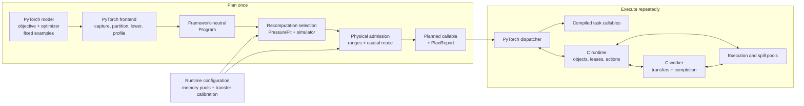
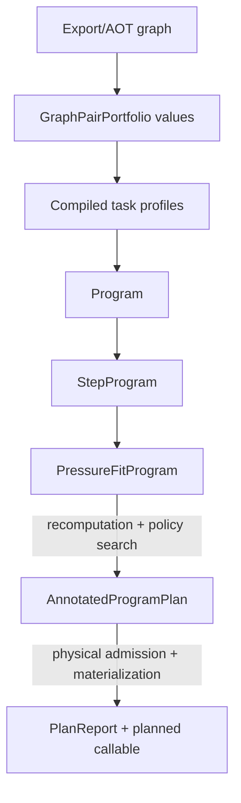
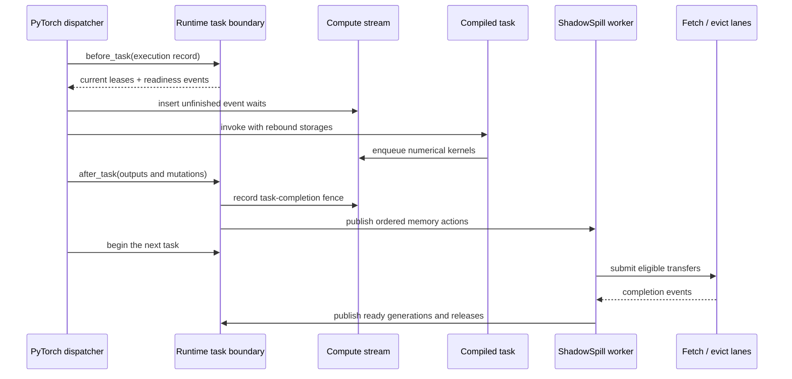

# Architecture overview

## Why ShadowSpill exists

A model can exceed execution-device memory even when each individual operator
fits. Ordinary eager allocation sees one request at a time; it does not know
which values will be needed later, which values can be recomputed, or when a
transfer can overlap useful compute.

ShadowSpill turns one fixed-shape PyTorch forward or accumulated training step
into an ordered, inspectable `Program`. It then:

1. measures the compiled tasks and their memory behavior;
2. chooses which intermediate values to save or recompute;
3. schedules object residency, fetches, evictions, and releases;
4. proves that the selected step fits the configured physical pools; and
5. returns a normal Python callable that repeatedly executes that admitted
   plan.

PyTorch and its compiled providers still perform every numerical operation.
ShadowSpill owns the memory policy around those operations: object identity,
residency, movement, readiness, capacity, and causal reuse.

## System at a glance

ShadowSpill has a one-time planning path and a repeated execution path:

The planning side decides what is legal and predicts its cost. The execution
side follows the admitted records; it does not rediscover graph semantics or
rerun memory-policy search.

## How planning responsibilities differ

The planning components answer deliberately different questions:

| Component | Question answered |
|---|---|
| Stage partitioning | Where is the captured model divided into ordered compiled tasks? |
| Graph-pair construction | What legal forward/backward implementations exist for one structural task ABI? |
| Recomputation selection | Which complete assignments of those local alternatives should the planner consider? |
| PressureFit | For one complete assignment, which objects reside where and when do memory actions trigger? |
| Simulator | What compute, transfer, dependency, and capacity timeline does that policy imply? |
| Physical admission | Can the selected task allocations and object lifetimes occupy real pool ranges without unsafe reuse? |
| Materialization | How are the admitted records and compiled callables installed into the runtime? |

Graph-pair construction is local: it builds options such as save and full
recompute for one structural ABI. Recomputation selection is global: one
selection chooses an option for every occurrence-level group. PressureFit then
evaluates each selected assignment together with residency and fetch policy.

## Planning artifacts

Each boundary produces an immutable artifact that can be inspected, cached,
serialized, or passed to a lower-level API:

| Artifact | Meaning | Reusable without |
|---|---|---|
| `Program` | Logical objects, tasks, profiles, resources, and graph-pair alternatives for one schedule role | PyTorch |
| `PressureFitProgram` | A `Program` plus residency, capacity, admission, and simulation inputs | Capture, compilation, or profiling |
| `StepProgram` | Recurrent and optional initialization programs plus training-step provenance | PressureFit or callable materialization |
| `AnnotatedProgramPlan` | One selected schedule, physical layout, simulation result, and planning diagnostics | The model or runtime |
| `PlanReport` | The published callable's Program, plan, execution mapping, profiles, cache lineage, and diagnostics | Console logging |

`make_step_program()` stops at `StepProgram`. `pressurefit_program()` consumes
one of its `PressureFitProgram` values under new budgets or transfer
bandwidths. `plan_step()` and `plan_forward()` run the complete pipeline.

## Runtime interaction

The Python dispatcher remains responsible for launching compiled PyTorch
tasks. Runtime progress belongs to the C worker:

`before_task()` covers runtime acquisition, readiness waits, storage rebinding,
and argument assembly. `after_task()` covers output classification, mutation
publication, releases, and action submission. A transfer dependency is placed
on the compute stream instead of making the dispatcher wait on the host when
stream ordering can express the dependency.

The supported topology has one execution-device pool, one registered
pinned-host spill pool, independent fetch and evict lanes, and one C worker.
The worker services lane submission, completion frontiers, and deferred
releases. It does not hold a general-purpose global runtime mutex.

## Component ownership

| Component | Owns | Does not own |
|---|---|---|
| PyTorch frontend | Export/AOT capture, stage partitioning, compiled callables, storage rebinding, objective and optimizer integration | Memory-policy search or transfer progress |
| IR | Objects, tasks, resources, graph-pair alternatives, schedules, and resolved execution records | PyTorch tensors or provider handles |
| Planner | Complete recomputation selections, residency strategies, memory actions, and candidate ranking | Graph construction or numerical execution |
| Simulator | Deterministic compute, transfer, capacity, and dependency replay | Candidate generation or physical placement |
| Physical admission | Allocation lifetimes, task-allocation ABI, fixed placements, dynamic scratch, and causal reuse dependencies | Logical PressureFit policy |
| Runtime | Pools, leases, objects, events, transfer lanes, task boundaries, failure state, and worker progress | Graph capture or model semantics |
| Backend | Provider allocation, copy, stream, event, and profiler operations | Object or schedule policy |

The framework-neutral IR, planner, simulator, admission engine, and runtime do
not import PyTorch. CUDA driver calls and NVTX implementation remain inside the
CUDA backend or PyTorch allocator adapter.

## One logical object through the system

A logical value retains one identity even as its physical address changes:

1. Capture identifies its producer, views, aliases, mutations, and stage.
2. A `TaskStorageContract` assigns a semantic storage root.
3. Compilation and profiling attach physical extents, allocation behavior,
   workspace, and timing without redefining that root.
4. `ObjectCatalog` maps the root to one canonical Program object across tasks.
5. Recomputation selection and PressureFit decide whether the value exists,
   resides, moves, or is recreated at each boundary.
6. Physical admission assigns ranges and proves every reuse dependency.
7. Materialization registers direct execution records with the runtime.
8. At execution, `before_task()` binds the current lease generation and
   `after_task()` publishes its successor generation.
9. The worker submits transfers and publishes completion; generation checks
   prevent stale work from modifying a successor.

Pointers therefore describe current placement, not semantic identity.

## Correctness invariants

- Semantic object identity never depends on a transient pointer, allocator
  callback identity, or incidental FakeTensor storage.
- A callable is published only after logical scheduling and physical admission
  succeed for the same selected Program.
- A pool range is reused only after stream order or an explicit completion
  dependency makes its predecessor inaccessible.
- Fetch and evict destinations consume capacity at their action trigger, even
  when the copy reaches its lane later.
- Every lease, event, transfer, and object publication is generation-checked;
  stale completion cannot mutate a successor.
- Execution and spill accounting never exceed their configured physical caps.
- Allocation behavior outside the admitted strict core is bounded by dynamic
  scratch; a mismatch fails before an invalid address reaches a kernel.
- Planner, simulator, admission, and runtime identities remain available in
  diagnostics so an executed step can be reconciled mechanically.

## Working vocabulary

| Term | Meaning |
|---|---|
| Stage | One ordered partition of the captured model graph. |
| Structural ABI | Shape, dtype, role, alias, mutation, and executable-storage contract shared by equivalent task occurrences. |
| Graph-pair portfolio | Every configured forward/backward alternative for one differentiated structural ABI. |
| Recomputation selection | One complete choice of graph-pair option for every occurrence-level group. |
| Storage root | One semantic allocation identity shared by all of its views. |
| Program object | One logical alias bundle with size, role, persistence, and task dependencies. |
| Action trigger | The task boundary at which a fetch, eviction, or release becomes ordered and destination capacity is reserved. |
| Physical admission | Proof that task allocations, object generations, transfers, and causal reuse fit the selected pools. |
| Memory lease | Ownership of one pool range for one residency generation. |

## Supported scope

| Capability | Current contract |
|---|---|
| Graph geometry | Fixed shape and stride under captured guards |
| Capture | Strict Export/AOTAutograd/Inductor with no graph breaks |
| Custom operations | Supported when fake/meta and alias/mutation schemas are complete |
| Data-dependent outputs | Unbounded output geometry is rejected during planning |
| Execution backend | PyTorch on one CUDA execution device |
| Spill backend | One registered pinned-host pool |
| Runtime ownership | One process runtime and one active planned callable |
| Transfer topology | One worker with independent fetch and evict lanes |
| Allocation variability | Admitted strict core plus bounded optional dynamic scratch |
| Cross-step residency | Not represented; startup fetches and final cooldown remain visible |

Unsupported behavior fails during capture, compilation, profiling, or
admission instead of selecting a heuristic semantic fallback.

## Architecture reading order

**Foundations**

1. [Intermediate representation](ir.md) defines Programs, objects, tasks, and
   schedules.

**PyTorch lowering**

2. [PyTorch capture and lowering](lowering.md) maps PyTorch semantics and
   compiled storage behavior into that IR.
3. [Graph-pair construction](graph-pair-construction.md) constructs local
   forward/backward alternatives.

**Planning**

4. [Recomputation selection](recomputation-selection.md) constructs bounded
   complete assignments across those alternatives.
5. [PressureFit](pressurefit.md) formulates logical residency and memory-action
   selection.
6. [Physical admission and offset handling](physical-admission.md) proves the
   selected plan against real pool geometry.
7. [Planning orchestration](planning.md) composes artifacts and publishes the
   callable and report.

**Execution**

8. [Simulation](simulation.md) defines deterministic timeline prediction.
9. [Memory runtime](memory-runtime.md) defines pools, leases, task boundaries,
   transfer lanes, completion, failure, and tracing.

The [Python guide](../python/README.md) and [C guide](../c/README.md) document
the corresponding public interfaces. The [examples](../examples/README.md)
apply the complete pipeline to practical workflows.

Next: [Intermediate representation](ir.md).
