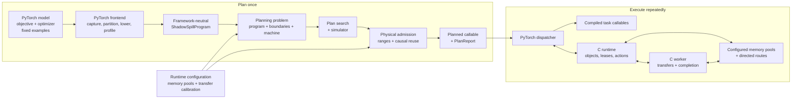
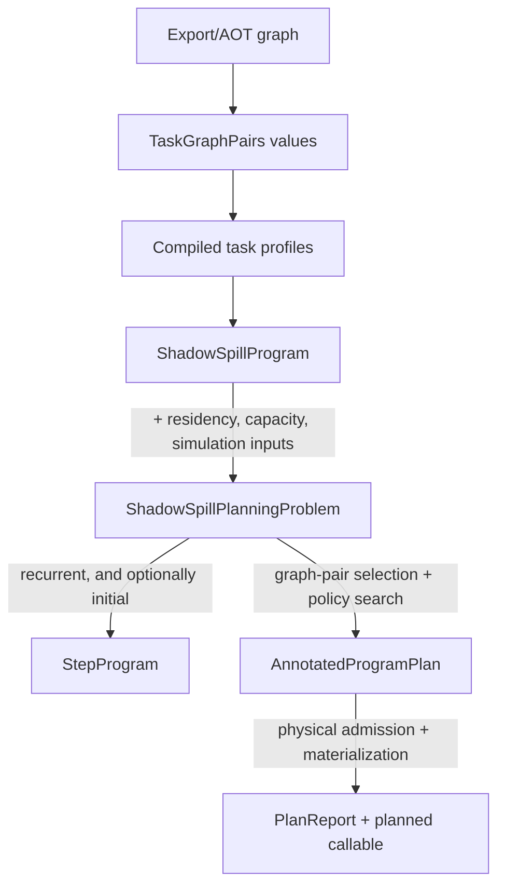
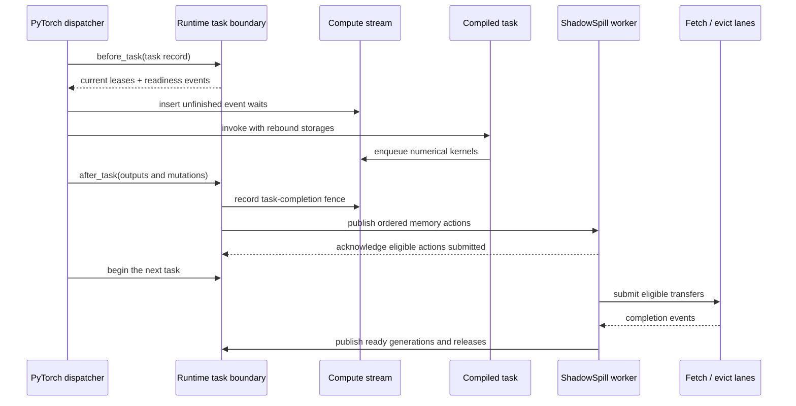

# Architecture overview

## Why ShadowSpill exists

A model can exceed execution-device memory even when each individual operator
fits. Ordinary eager allocation sees one request at a time; it does not know
which values will be needed later, which values can be recomputed, or when a
transfer can overlap useful compute.

ShadowSpill turns one fixed-shape PyTorch forward or accumulated training step
into an ordered, inspectable `ShadowSpillProgram`. It then:

1. measures the compiled tasks and their memory behavior;
2. chooses which intermediate values to save or recompute;
3. schedules object residency, fetches, write-backs, evictions, and
   releases;
4. proves that the selected step fits the configured physical pools; and
5. returns a normal Python callable that repeatedly executes that admitted
   plan.

PyTorch and its compiled providers still perform every numerical operation.
ShadowSpill owns the memory policy around those operations: object identity,
residency, movement, readiness, capacity, and causal reuse.

## System at a glance

ShadowSpill has a one-time planning path and a repeated execution path:

The planning side decides what is legal and predicts its cost. The execution
side follows the admitted records; it does not rediscover graph semantics or
rerun memory-policy search.

The three planning boxes are three different things, and the pipeline reads
badly if they blur: a [program](program.md) is the work, a [planning
problem](planning-problem.md) is a question about it, and a
[search](search.md) answers that question. Which search runs is pluggable --
[PressureFit](pressurefit.md) is the one that ships, and the box says "plan
search" rather than its name because nothing upstream or downstream depends
on which it is.

## Libraries and responsibilities

The shipped libraries are four kinds of shared object with one direction of
dependency, and a Python package above them:

| Library | Holds | Knows about |
|---|---|---|
| `libshadowspill.so` | the neutral C library: IR digests, the simulator, physical admission, the search that ships, and the runtime with its [memory pools](memory-pools.md), [lanes](lanes.md), [transfers](transfers.md), [events](events.md), task boundaries, tracing, and the profiler ranges and timing markers a caller measures with. Its planner header names no search; the shipped one has a header of its own beside it | three contracts it declares and none of which it links: the backend, the lane, and a pool's memory |
| `libshadowspill_backend_<provider>.so` | one provider's implementation of the [backend contract](backends.md): device allocation, host registration, streams, copies, events, profiler | its driver and nothing of ShadowSpill's |
| `libshadowspill_network.so` | an extension library: pool kinds, and later lanes, whose memory is not on this machine. It exports one symbol, a descriptor of what it offers, and the far side of a remote pool is a separate program, `shadowspill_memory_daemon`, that links no ShadowSpill library at all | the runtime's contracts, and nothing of the runtime's internals |
| `libshadowspill_pytorch.so` | the [PyTorch adapter](adapter.md): the pluggable allocator, objects and storage views, the task boundary, and the dlopen of the backend and of any extension library | PyTorch and the neutral runtime |
| `shadowspill` (Python) | two halves along one line. `shadowspill.pytorch` captures, lowers, compiles and profiles a step, and holds the planned callables. Everything else -- the IR, the step, one task's shape, the store, profiling records, the planner, the search, the simulator, the pipeline, the runtime and the diagnostics -- names no framework and imports none | the frontend half knows PyTorch and the adapter's C API; the neutral half knows only the neutral library |

**The runtime loads nothing.** It is handed a backend table at create, and
lists of pool kinds and lanes already filled in; the adapter is what opens
those libraries by name at bootstrap, which is why `libshadowspill.so` links
libc and nothing else.

Every object with a lifetime or a policy -- pools, routes, event pools,
calibration -- is the neutral library's. What it does *not* fix is where a
pool's region comes from or what moves bytes between two pools: each is a
contract the neutral library declares and something else implements, found by
one lookup whether the implementation is built in or loaded. That is what lets
a new provider, a new kind of memory, or a new transport arrive with no change
above it.

## How planning responsibilities differ

The planning components answer deliberately different questions:

| Component | Question answered |
|---|---|
| Stage partitioning | Where is the captured model divided into ordered compiled tasks? |
| Graph-pair construction | What legal forward/backward implementations exist for one structural task contract? |
| Graph-pair selection | Which complete assignments of those local alternatives should be considered? |
| Plan search | For each assignment, which objects reside where and when do memory actions trigger -- and which assignment wins? |
| Simulator | What compute, transfer, dependency, and capacity timeline does that policy imply? |
| Physical admission | Can the selected task allocations and object lifetimes occupy real pool ranges without unsafe reuse? |
| Materialization | How are the admitted records and compiled callables installed into the runtime? |

Graph-pair construction is local: it builds options such as save and full
recompute for one structural contract. Graph-pair selection is global: one
selection chooses an option for every occurrence-level group. Both leave the
alternatives *open* in the program, and the search fixes them: expanding a
program into resolved programs and comparing what each answers is a
[search's own work](search.md), which is why the diagram above shows one box
and not two.

## Planning artifacts

Each boundary produces an immutable artifact that can be inspected, cached,
serialized, or passed to a lower-level API:

| Artifact | Meaning | Reusable without |
|---|---|---|
| `ShadowSpillProgram` | Logical objects, tasks, profiles, resources, and graph-pair alternatives for one schedule role | PyTorch |
| `ShadowSpillPlanningProblem` | A `ShadowSpillProgram` plus residency, capacity, admission, and simulation inputs | Capture, compilation, or profiling |
| `StepProgram` | The recurrent and optional initial `ShadowSpillPlanningProblem`, plus training-step provenance | Searching or callable materialization |
| `AnnotatedProgramPlan` | One selected schedule, physical layout, simulation result, and planning diagnostics | The model or runtime |
| `PlanReport` | The published callable's program, plan, execution mapping, profiles, artifact-store hits and misses, and diagnostics | Console logging |

`build_step_programs()` stops at `StepProgram`, one per ordering.
`plan_program()` consumes one of a program's `ShadowSpillPlanningProblem` values under new budgets or transfer
bandwidths. `plan_step()` and `plan_forward()` run the complete pipeline.

## Runtime interaction

The Python dispatcher remains responsible for launching compiled PyTorch
tasks. Runtime progress belongs to the C worker:

`before_task()` covers runtime acquisition, readiness waits, storage
rebinding, argument assembly, and the range-reuse waits of every allocation
the plan pinned to the task, so a task that has started is a task that only
computes. `after_task()` covers output classification, mutation publication,
releases, destination reservation, action publication, and the worker
submission acknowledgement -- which means the batch's fetches have been issued
and carry readiness events, never that any byte has moved. A transfer
dependency is placed on the compute stream instead of making the dispatcher
wait on the host when stream ordering can express the dependency.

The runtime owns explicit pool, route and plan registries, and coordinates them
rather than answering for their contents. It knows how many pools there are and
which plan each issued id names; a pool answers for its own capacity, occupancy,
fragmentation and lease records, and a plan for its own tasks and layout. Pools
carry no role of their own -- each immutable plan independently binds its
execution pool, spill pool, fetch route, and evict route -- so "the execution
pool" is a statement about a plan and never about the runtime. The worker
services route submission, completion frontiers, and deferred releases without
holding a general-purpose global runtime mutex.

At the Python boundary, `submit()` returns one invocation-owned result handle.
Its `result()` method waits for the instant the runtime recorded when that
invocation's work finished -- the frontend holds no device event of its own.
Different planned callables can therefore be host-dispatched together, while
each callable retains a simple single-outstanding-invocation invariant. A
later invocation waits only for the same plan's terminal actions and
retirements; unrelated plans continue independently.

## Component ownership

| Component | Owns | Does not own |
|---|---|---|
| PyTorch frontend | Export/AOT capture, stage partitioning, compiled callables, storage rebinding, objective and optimizer integration | Memory-policy search or transfer progress |
| IR | Objects, tasks, resources, graph-pair alternatives, schedules, and resolved task records | PyTorch tensors or provider handles |
| Planner | The question a search is asked, the contract it answers under, the helpers any search may call, certification, and the stores a plan is keyed in | How a plan is found, graph construction, or numerical execution |
| Search | Resolving a program into the alternatives it will compare, residency strategies, memory actions, and ranking what it places | The question it is handed, or whether its answer is physically admissible |
| Simulator | Deterministic compute, transfer, capacity, and dependency replay | Candidate generation or physical placement |
| Physical admission | Allocation lifetimes, task-allocation contract, fixed placements, dynamic scratch, and causal reuse dependencies | Which search produced the schedule, or its logical policy |
| Runtime | The registries and the work across them: which pools, routes and plan ids exist and what each names, objects, calibration, event and timing pools, task boundaries, failure state, and worker progress | Graph capture or model semantics, or anything a pool or a plan answers for itself |
| Memory pool | One bounded region and its suballocation: the leases in it, its capacity, occupancy, largest free range and fragmentation, and its lease-record reserves | Its role in any plan, or what another pool holds |
| Backend | The driver-level table: device allocation, host memory registration, streams, copies, events, the provider's capabilities, physical memory and statistics, and profiler names and ranges | Any object lifetime or policy: pools, routes, lanes, event pooling |
| PyTorch adapter | The pluggable allocator, object and storage views, the task boundary, and loading by name the backend and any extension library the runtime's two registered lists are filled from | Provider headers, planning, tracing, or profiler ranges -- those are the runtime's and are called there |

The framework-neutral IR, planner, simulator, admission engine, and runtime do
not import PyTorch, and a test asserts it rather than leaving it to
convention. Producing a program -- capture, lowering, compilation, profiling
-- is the frontend's work; everything from a program onwards is neutral, so
planning a saved program pulls in no framework. Provider driver and profiler
calls remain inside concrete backends or framework adapters.

## One logical object through the system

A logical value retains one identity even as its physical address changes:

1. Capture identifies its producer, views, aliases, mutations, and stage.
2. A `TaskStorageContract` assigns a semantic storage root.
3. Compilation and profiling attach physical extents, allocation behavior,
   workspace, and timing without redefining that root.
4. `ObjectCatalog` maps the root to one canonical program object across tasks.
5. Graph-pair selection and the search decide whether the value exists,
   resides, moves, or is recreated at each boundary.
6. Physical admission assigns ranges and proves every reuse dependency.
7. Materialization registers direct task records with the runtime.
8. At execution, `before_task()` binds the current lease generation and
   `after_task()` publishes its successor generation.
9. The worker submits transfers and publishes completion; generation checks
   prevent stale work from modifying a successor.

Pointers therefore describe current placement, not semantic identity. For a
recurrent shared output, the producer updates this same logical object record;
it does not manufacture another identity. The prior lease retires behind its
causal completion fence before a successor can reuse its bytes.

## Correctness invariants

- Semantic object identity never depends on a transient pointer, allocator
  callback identity, or incidental FakeTensor storage.
- A callable is published only after logical scheduling and physical admission
  succeed for the same selected program.
- A pool range is reused only after stream order or an explicit completion
  dependency makes its predecessor inaccessible.
- Fetch and evict destinations consume capacity at their action trigger, even
  when the copy reaches its lane later.
- Every lease, event, transfer, and object publication is generation-checked;
  stale completion cannot mutate a successor.
- Execution and spill accounting never exceed their configured physical caps.
- Allocation behavior outside the admitted invariant path is bounded by
  dynamic scratch; a mismatch fails before an invalid address reaches a kernel.
- Planner, simulator, admission, and runtime identities remain available in
  diagnostics so an executed step can be reconciled mechanically.

## Working vocabulary

The terms divide the way the system does, and it is worth keeping the halves
apart: the first set is what any program says, whatever produced it; the second
is what the PyTorch frontend calls the things it lowers. Nothing below the
frontend interprets a term from the second table.

**Any program**

| Term | Meaning |
|---|---|
| Task | One unit of work a program is made of: the objects it reads, writes and mutates, what it depends on, and the measurement of what it costs. A program is tasks over objects and nothing else. |
| Program object | One logical alias bundle with size, role, persistence, and task dependencies: the values tasks read and write. |
| Phase | A plain identifier string on a task, defaulting to `compute`. The IR never interprets it; a program uses whatever names describe its own structure. |
| Action trigger | The task boundary at which a fetch, write-back, eviction, or release becomes ordered and destination capacity is reserved. |
| Physical admission | Proof that task allocations, object generations, transfers, and causal reuse fit the selected pools. |
| Memory lease | Ownership of one pool range for one residency generation. |
| Scope | What an allocation belongs to. Every allocation belongs to exactly one, and a lease records the scope with the plan that owns it. [Task boundaries](task-boundaries.md#the-allocation-scope) has the two kinds. |

**What the PyTorch frontend lowers**

| Term | Meaning |
|---|---|
| Stage | One ordered partition of the captured model graph. |
| Structural contract | Shape, dtype, role, alias, mutation, and executable-storage contract shared by equivalent task occurrences. |
| Task graph pairs | Every configured forward/backward alternative for one differentiated structural contract. The IR sees only alternatives with different resource profiles, and knows nothing of what they mean. |
| Graph-pair selection | One complete choice of graph-pair option for every occurrence-level group. |
| Storage root | One semantic allocation identity shared by all of its views. |

A training program labels its tasks `forward`, `backward` and `optimizer`;
those are values in the first table's `Phase`, not concepts the planner,
simulator or runtime know.

**Nothing in the second table is required.** Alternatives are the clearest
case: a task group offers them only when a frontend has more than one way to
run it, and a program that never does carries none. Lowering a `forward()` for
inference is exactly that -- it produces tasks with no alternatives at all, and
the planner has no choice to fix, so [graph-pair
selection](graph-pair-selection.md) has nothing to select. The rest is
unchanged: the same search decides what stays resident and what moves, the same
admission proves it fits, and the same runtime executes it. Planning is worth
doing wherever a step's objects do not all fit at once, which is a question
about size rather than about gradients. A program that came from something
other than a model reaches the same code the same way.

[The ShadowSpillProgram](program.md) states the separation in full.

## Planning contract

| Capability | Contract |
|---|---|
| Graph geometry | Fixed shape and stride under captured guards |
| Capture | Strict Export/AOTAutograd/Inductor with no graph breaks |
| Custom operations | Supported when fake/meta and alias/mutation schemas are complete |
| Data-dependent outputs | Unbounded output geometry is rejected during planning |
| Execution pools | Framework-accessible memory supplied by configured device backends |
| Spill pools | Runtime-configured memory pools connected by directed transfer routes |
| Runtime ownership | Runtime-owned pools, objects, leases, and callable registrations |
| Transfer lanes | One lane per route, resolved from the two pools' kinds; it makes its event complete when the bytes land, and the runtime does not drive it |
| Allocation variability | The admitted invariant allocation path plus bounded optional dynamic scratch |

Unsupported behavior fails during capture, compilation, profiling, or
admission instead of selecting a heuristic semantic fallback.

## Architecture reading order

The pages form one path from capture to execution. The [documentation
index](../README.md) annotates the same order; this is the map.

**Foundations**

1. [Intermediate representation](ir.md) -- the objects, tasks, schedules and
   digests every other page is written in terms of.

**PyTorch lowering**

2. [PyTorch capture and lowering](lowering.md) -- PyTorch semantics and
   compiled storage behavior, mapped into that IR.
3. [Graph-pair construction](graph-pair-construction.md) -- local
   forward/backward alternatives for one structural contract.
4. [The step artifacts](step.md) -- what a captured step is, and why its two
   values need no framework to read.
5. [Importing state](state-import.md) -- how a model's state reaches a pool
   with no host copy of itself, and how dtype is decided.
6. [The optimizer](optimizer.md) -- state declared on meta and filled by the
   caller, and values a step may set.

**Planning**

7. [The ShadowSpillProgram](program.md) -- what the system plans for.
8. [The planning problem](planning-problem.md) -- the question asked about it.
9. [Simulation](simulation.md) -- the deterministic timeline a search prices
   its candidates against, read before the searches that do.
10. [Plan search](search.md) -- what the planner asks of a search, and
    promises it.
11. [Writing a search algorithm](search-algorithm.md) -- the methods to
    implement, every argument, and a worked example.
12. [Graph-pair selection](graph-pair-selection.md) -- bounded complete
    assignments across those alternatives.
13. [PressureFit](pressurefit.md) -- the search that ships: logical residency
    and memory-action selection.
14. [Physical admission and offset handling](physical-admission.md) -- the
    selected plan proved against real pool geometry.
15. [From a resolved program to leases](admission-leases.md) -- what a
    schedule allocates, and when each lease is live.
16. [Fixed-offset placement](fixed-placement.md) -- how leases are given
    addresses, and what that costs.
17. [The planning pipeline](planning-pipeline.md) -- artifacts composed, callable and
    report published.

**Execution**

18. [Plan identity](plan-identity.md) -- what names a plan, what a lease
    records, and the registry that answers an id after its plan is gone.
19. [Shared objects](shared-objects.md) -- one value reached by several plans:
    its per-pool locations, and why binding it allocates nothing.
20. [Backends](backends.md) -- the driver-level table a provider implements,
    which the three pages after it are built from.
21. [Memory pools](memory-pools.md) -- the memory each pool owns, where that
    memory comes from, and what one hands out.
22. [Lanes](lanes.md) -- what moves bytes between two pools, and how a route
    finds one from the kinds it connects.
23. [Transfers](transfers.md) -- routes, the queue each owns, and calibration.
24. [Events](events.md) -- event leases and their pools, and the markers a
    caller times its own work with.
25. [Memory runtime](memory-runtime.md) -- leases, causal reuse, the worker,
    failure, and tracing, over those three.
26. [Task boundaries](task-boundaries.md) -- what `before_task` and
    `after_task` do, and what is still in flight when the dispatcher returns.
27. [Failure, abort, and process exit](failure-and-exit.md) -- what each scope
    does with a failure, and why an exiting process is abandoned.
28. [Step boundaries](step-boundaries.md) -- the recurrent invocation cycle,
    and what step time means.
29. [PyTorch adapter](adapter.md) -- what sits between PyTorch and the
    runtime.
30. [Timelines](timelines.md) -- how a traced step is measured on the device
    clock.

The [Python guide](../python/README.md) and [C guide](../c/README.md) document
the corresponding public interfaces. The [examples](../examples/README.md)
apply the complete pipeline to practical workflows.

Next: [Intermediate representation](ir.md).
