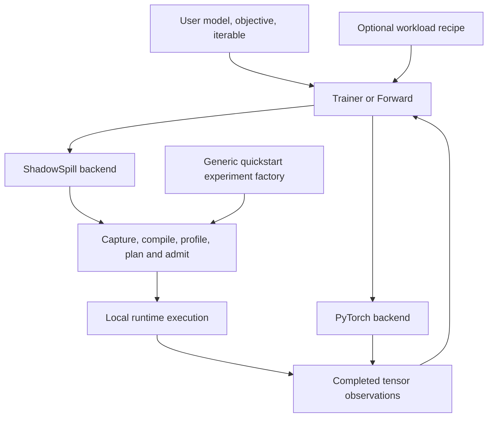

# Training composition

The generic runner executes caller-supplied work. Model examples, text packing
and qualification thresholds sit outside it.

## Responsibilities

| Component | Owns |
| --- | --- |
| Caller model/objective | Forward math, differentiable scalar, optional small observations |
| Caller data iterable | One logical update per item, and optional progress serialization |
| Microbatch function | Splitting one update and assigning each contribution's loss scale |
| `Trainer` | Update count, schedule evaluation, optional fit/eval/log/checkpoint loop |
| `DistributedLogger` | Asynchronous CPU metric aggregation and optional grouped W&B runs; per-rank records remain independent |
| `Forward` | Forward preparation/calls and temporary module mode |
| Execution backend | Model placement/import, optimizer construction, prepared execution lifecycle |
| PyTorch frontend | Tensor capture, differentiation, compilation, profiling and lowering |
| Neutral planner/runtime | Local object lifetimes, offload/recompute schedule and physical admission |
| `workloads/recipes/text` | Token ingestion, document packing, valid-target normalization and text metrics |
| `qualification` | Test geometries, hardware policies, references and acceptance thresholds |
| `benchmarking.quickstart` | Factory composition, named-candidate search, per-budget execution and diagnostics |

The installed `shadowspill.training` package does not import workload recipes or
qualification cases. Backends receive the objective and concrete representative
microbatches, without a tokenizer, model family or data-source implementation.
PyTorch pytrees carry arbitrary tensor structures. Input shape/alias guards are
still enforced by prepared execution.

## State and lifetime

A ShadowSpill backend context installs the local runtime before accelerator
resources are created. CPU initialization is ordinary caller code; meta models
need an explicit initializer or checkpoint. Import retains model values and
state names. Parameter groups are resolved against the imported model.

A backend may serve training and forward sessions over the same imported state.
A forward plan can borrow an admitted training slab when it fits. Borrowing
sessions close before their owners, then imported state is released and the
backend closes. The backend closes remaining sessions in reverse order.

Preparation does not consume data, advance schedules or commit an optimizer
update. A resumed trainer chooses its saved candidate before preparing, restores
optimizer/loop/RNG state, and optionally restores source progress.

## Data and observation semantics

A source item represents a whole update. The caller either supplies an already
normalized objective, or supplies per-microbatch loss scales. Gradients sum;
no model, token-count or replica-count rule is inferred. Runtime scalar weights
allow normalizers to vary while a fixed-shape graph remains reusable.

The objective and parameter observers return tensors from compiled work.
Returned per-microbatch metrics remain separate until a caller reducer combines
them. Host conversion happens after step completion. Optional logger/callback
code does not enter a compiled task.

## Search and quickstart

`plan_step_search` accepts named representative updates. Every candidate supplies
its own microbatch sequence. It captures/profiles once per candidate, lowers each
requested ordering, and evaluates budgets. Report metadata can name throughput
units; neither search nor plots assume language-model tokens.

Quickstart invokes a supplied experiment factory after runtime installation,
then uses the ordinary planning API. Text CLI presets build the same experiment
mapping through an optional recipe. Stores, incremental result tables, traces
and plots belong to the run directory. Per-budget model factories must recreate
identical initial state for a comparable measurement.

## Distributed execution boundary

`Distributed` belongs to the PyTorch frontend and is re-exported by the generic
trainer. The caller first creates a Gloo control group; Runtime checks combined
host reservations before pinning its pools. Accelerator communication groups and model resources are
then created by the caller. Initial parameter synchronization follows explicit
replica ownership; independent mutable buffers stay local.

Preparation aligns capture/profile invocations, cache decisions, common task
selections, and admission. Runtime tasks and fetch/evict use local progress with
no added global task barrier. Intra-task communication completes before that
local task's completion event. The neutral simulator models each admitted local
sequence using the coordinated profiles.

Local optimizer math is wrapped in explicit gradient SUM, owned-state update,
and compute-weight exchange tasks. Optimizer state and optional masters are
sharded by default. The text quickstart recipe supplies token normalization;
the generic trainer and benchmark do not infer a replica-count denominator.

Checkpoints store one selected weight representation: masters by default, or
compute weights on request. Restore casts into compute and configured master
storage; rank-local buffers, RNG, data progress and moments are separate state.

See the [training API](../python/api/training.md),
[distributed guide](../python/api/distributed.md),
[planning pipeline](planning-pipeline.md), and
[quickstart runner](../../benchmarking/quickstart.md).

## Diagnostics and reporting

Opt-in startup diagnostics run the admitted task sequence at zero LR only when
the optimizer advertises state-preserving zero-LR updates. All optimizer work and
communication still execute. The runner restores mutable model buffers and RNG,
without snapshotting parameters or optimizer moments, and saves each rank's trace
and occupancy pages. These invocations do not advance training/data/logging state.

Reporting consumes CPU observations after step completion. A dedicated bounded
mailbox asynchronously combines matching rank records; it does not enter task
coordination or add a runtime barrier. Default loss contributions are additive
and already globally normalized; applications supply a reducer for other
aggregation semantics. Each rank retains its own records and optional W&B run,
with an additional aggregate run in the same W&B group. Ordinary torchrun provides
process supervision, rank-tagged console output and stdout/stderr files.
