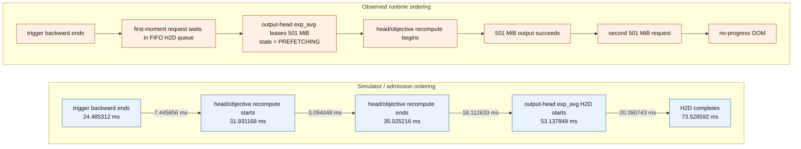
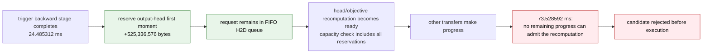

# A Timing-Dependent Prefetch Admission Failure

## Purpose

This document describes a real ShadowSpill failure in which the planner and
simulator accepted a memory schedule, but the same schedule could not execute
in the slab runtime. It is intentionally self-contained. The example motivates
an important correctness rule:

> A transfer trigger must reserve its destination capacity at the trigger
> boundary. The transfer may start later, but the schedule's physical
> feasibility must not depend on exactly when a serialized transfer lane reaches
> the request.

The incident occurred while running an approximately one-billion-parameter
Llama 3 training qualification with optimized PyTorch operations. The operation
provider is not relevant to the bug; it merely supplied a large, easily
identifiable tensor allocation.

The report uses semantic names first. Internal dense IDs are included only so
the evidence can be found in a trace:

| Name used here | What it does | Internal ID |
|---|---|---|
| Trigger backward stage | Backpropagates one repeated transformer block near the beginning of the first microbatch's reverse traversal | `task_000044` |
| Head/objective recomputation stage | Recomputes the second microbatch's final transformer block, final normalization, output head, and scalar objective as part of backward | `task_000071` |
| Output-head AdamW update | Applies AdamW to the output-head weight and consumes its optimizer state | `task_000181` |
| Output-head first moment | BF16 AdamW `exp_avg` state for `lm_head.weight` | `alias_000483` |

## Relevant execution model

ShadowSpill executes ordinary PyTorch tasks on a compute stream and has one
background progress thread controlling an H2D stream and a D2H stream. A memory
schedule attaches actions to completed compute tasks. For example:

```text
after the trigger backward stage completes:
    prefetch the output-head first-moment tensor from host to device
```

H2D requests retain schedule order and use one physical H2D lane. A triggered
request may therefore wait behind older requests before its copy can be put on
the wire.

The device uses one conventional CUDA allocation as a slab. All byte counts in
this report refer to subranges of that already allocated slab; leasing or
reserving a range does not call `cuMemAlloc`.

The failing plan had these budgets:

| Quantity | Bytes | MiB |
|---|---:|---:|
| Public physical device cap | 10,737,418,240 | 10,240.00 |
| CUDA context accounting | 522,190,848 | 498.00 |
| Provider headroom | 536,870,912 | 512.00 |
| Device slab | 9,678,356,480 | 9,230.00 |
| Fixed provider allocation inside the slab | 33,554,432 | 32.00 |
| General workspace admission reserve | 719,323,136 | 686.00 |
| Simulator object-capacity parameter | 9,569,544,208 | 9,126.23 |

The simulator capacity differs from the raw slab size because the planning
model admits a conservative general reserve while adding the largest measured
task workspace back when that particular task executes. Exact spatial
admission separately replays allocation and free callbacks through the real
slab placement policy.

## Task and object inventory

The three named stages have the following complete memory interfaces. Sizes are
physical storage bytes; views sharing one storage are counted once in residency
decisions.

### Trigger backward stage (`task_000044`)

This stage backpropagates one Llama transformer block for the first microbatch.
Its completion is used only as the scheduling trigger for the future
output-head optimizer-state prefetch.

| Interface category | Contents | Bytes |
|---|---|---:|
| Parameter inputs | Two 2,048-element RMSNorm weights; 2,048x2,048 query and attention-output matrices; two 2,048x512 key/value matrices; three 2,048x7,168 / 7,168x2,048 MLP matrices | 109,060,096 |
| Buffer inputs | Two rotary-position tables | 196,608 |
| Saved activation and incoming-gradient inputs | Block input, normalization statistics, attention/MLP intermediates, masks/index metadata, and incoming hidden-state gradient | 4,985,872 logical bytes; 4,723,728 unique bytes after one shared view is deduplicated |
| **All logical inputs** | 29 tensor values | **114,242,576** |
| Persistent outputs | Gradients for all 9 parameter storages plus the 262,144-byte gradient passed to the preceding block | **109,322,240** |
| Mutated inputs | None; gradients are explicit outputs | **0** |
| Anonymous workspace high-water | Temporary kernel/compiler allocations | **7,237,648** |

### Head/objective recomputation stage (`task_000071`)

This stage recomputes the second microbatch's last transformer block, final
normalization, output projection, and scalar objective. It is where allocation
failed.

| Interface category | Contents | Bytes |
|---|---|---:|
| Parameter inputs | Last-block attention/MLP/norm parameters, final RMSNorm, and the 128,256x2,048 BF16 output-head weight | 634,400,768 |
| Buffer inputs | Two rotary-position tables | 196,608 |
| Activation/data inputs | 96-token hidden state, packed-sequence metadata, and target tokens | 394,752 |
| **All inputs** | 16 tensor values | **634,992,128** |
| Persistent outputs | Scalar objective (4 bytes), 7,085,200 bytes of saved block/head residuals, and a 525,336,576-byte precomputed output-head-gradient residual | **532,421,780** |
| Mutated inputs | None | **0** |
| Anonymous workspace high-water | One 525,336,576-byte head matrix, two 24,625,152-byte chunks, one 393,216-byte buffer, and one 4-byte scalar | **574,980,100** |

The stage therefore requires 1,107,401,880 new bytes at its admitted peak:
532,421,780 bytes of persistent outputs plus 574,980,100 bytes of anonymous
workspace.

### Output-head AdamW update (`task_000181`)

This later optimizer stage is the actual consumer for which the early prefetch
was scheduled.

| Interface category | Contents | Bytes |
|---|---|---:|
| Parameter input | `lm_head.weight` | 525,336,576 |
| Gradient input | Accumulated `lm_head.weight.grad` | 525,336,576 |
| First-moment input | `lm_head.weight.exp_avg` | 525,336,576 |
| Second-moment input | `lm_head.weight.exp_avg_sq` | 525,336,576 |
| Step input | AdamW step counter | 8 |
| **All inputs** | Five tensors | **2,101,346,312** |
| Mutations | Parameter, first moment, second moment, and step counter are updated in place | **1,576,009,736** unique bytes |
| Persistent outputs | None; results are the declared mutations | **0** |
| Anonymous workspace | None observed | **0** |

The output-head first moment is not an input to either earlier compute stage.
It is prefetched early solely to overlap its 501 MiB H2D with intervening
backward computation before this AdamW update.

## The two important allocations

The output-head first moment (`optimizer.lm_head.weight.exp_avg`, internal ID
`alias_000483`) has the geometry of the full output-head matrix:

```text
128,256 vocabulary entries x 2,048 hidden values x 2 BF16 bytes
    = 525,336,576 bytes
    = 501.00 MiB
```

The head/objective recomputation stage is the selected recomputation for the
second microbatch's last transformer block, final normalization, output head,
and objective. Its profiled allocation trace contains both of the following
501 MiB allocations:

1. Allocation ordinal 21 is a returned output leaf: the full embedding/head
   gradient. It becomes a persistent Program object and must remain live after
   the task.
2. Allocation ordinal 28 is an anonymous matrix temporary used by the chunked
   head-loss implementation. It is freed before the task returns.

The output cannot be freed before ordinal 28: they are simultaneously necessary
for the ordinary PyTorch arithmetic. Between them, allocation ordinals 22 and
23 each request 24,625,152 bytes. The complete measured anonymous workspace
high-water for this stage is 574,980,100 bytes.

This rules out a Python lifetime leak. PyTorch did logically free ordinal 28
when it left scope. The failure happened while trying to allocate it, before
there was anything to free.

## Exact failure site

The deadlock was triggered by one specific synchronous PyTorch allocator call:

| Field | Value |
|---|---|
| Executing stage | Head/objective recomputation for microbatch 2 (`task_000071`) |
| Profile allocation ordinal | **28** |
| Allocation category | Anonymous operation workspace; not a Program object |
| Requested/charged bytes | **525,336,576 (501.00 MiB)** |
| Tensor geometry | 128,256 x 2,048 BF16 matrix |
| Source operation | Temporary result of `grad_logits.T @ hidden_chunk` in the chunked output-head loss |
| Provider source at capture | `mlops/providers/builtin/head.py`, in the chunked backward accumulation into `grad_head` |
| Native failure identity | No object ID and no allocation ID, because the `malloc` never succeeded |

The relevant operation updates an already allocated output-head gradient:

```python
grad_head.add_((grad_logits.T @ hidden_chunk).to(grad_head.dtype))
```

The multiplication needs a full 501 MiB temporary before `add_` can consume it.
PyTorch calls the ShadowSpill pluggable allocator synchronously while executing
this operation. The allocator first waits for three already-recorded stream
retirements, wakes, recomputes its free-range ledger, and then proves that no
remaining event can provide the requested range. That ordinal-28 `malloc` is
the initial and exact call that turns the incorrect plan into a no-progress
OOM. No earlier task or allocator request failed.

It is important not to confuse it with allocation ordinal 21:

| Order in the same stage | Allocation | Outcome |
|---|---|---|
| Ordinal 21 | 525,336,576-byte persistent output-head-gradient residual | Succeeds and must remain live |
| Ordinals 22 and 23 | Two 24,625,152-byte chunk temporaries | Succeed |
| Ordinal 28 | 525,336,576-byte anonymous matrix product | **Blocks, then fails** |

The failure occurs inside the stage, before its `after_task` boundary. No
release attached to completion of this stage can help, because the stage cannot
complete until ordinal 28 has been allocated and the matrix multiplication has
run.

## What the simulator expected

The selected schedule contains:

```text
trigger backward stage (task_000044) completion
    -> PREFETCH output-head first moment (alias_000483)

output-head AdamW update (task_000181) completion
    -> OFFLOAD output-head first moment (alias_000483)
```

The old simulator treated the prefetch trigger as only a logical queue entry.
It charged device capacity when it predicted that the request would reach the
head of the H2D lane. Its predicted timeline was:

| Event | Simulator time |
|---|---:|
| Trigger backward stage starts | 23.068896 ms |
| Trigger backward stage completes; first-moment prefetch becomes ready | 24.485312 ms |
| Head/objective recomputation starts | 31.931168 ms |
| Head/objective recomputation completes | 35.025216 ms |
| Output-head first-moment H2D starts | 53.137849 ms |
| Output-head first-moment H2D completes | 73.528592 ms |
| Output-head AdamW update becomes ready | 65.614400 ms |
| Output-head AdamW update starts after residency stalls | 93.924336 ms |

The predicted 501 MiB H2D lasts 20.390743 ms using the configured 24 GiB/s
bandwidth and 5 microsecond launch latency. More importantly, its predicted
start is 18.112633 ms after the head/objective recomputation has finished. The
simulator therefore expected the output-head first moment to consume no device
range during that stage.

The central ordering mismatch is shown below. Runtime observations before the
unified timestamp trace are causal rather than proportional, so only the
simulator lane carries absolute times.



The relevant lifetimes consequently differed in exactly one place:

| Object/range | Simulator and admission | Actual runtime |
|---|---|---|
| Head/objective stage's 501 MiB persistent gradient output | Allocated during the stage; retained afterward | Same |
| Head/objective stage's 501 MiB anonymous matrix temporary | Live within the stage; freed before return | Allocation attempted within the stage, but failed |
| Output-head first-moment 501 MiB prefetch destination | Not live during the stage; predicted live beginning at 53.137849 ms | Already live and `PREFETCHING` before the stage |

At the head/objective recomputation's start, the simulator ledger changed as
follows:

| Simulator ledger at the head/objective stage | Bytes |
|---|---:|
| Program objects immediately before task outputs | 7,936,627,936 |
| Program objects after task output admission | 8,469,049,716 |
| Charged task workspace | 574,980,100 |
| Simultaneously charged total | 9,044,029,816 |
| Simulator capacity | 9,569,544,208 |
| Remaining modeled capacity | 525,514,392 |

Thus the aggregate model retained 525,514,392 bytes of headroom at the task's
admitted peak, just 177,816 bytes more than one 501 MiB extent. Exact spatial
admission also passed: the stage's allocation/free callbacks occurred at replay
positions 1,608 through 1,639, while the allocation of the
output-head first-moment prefetch destination did not occur until replay
position 2,604,
corresponding to the predicted 53.137849 ms transfer start.

In short, both simulator and admission proved a timeline in which the
head/objective stage used the relevant 501 MiB range first and the output-head
first moment used it later.

The progressive simulator ledger is:

| Step | Objects (bytes) | Workspace (bytes) | Total charged (bytes) | Capacity left (bytes) |
|---|---:|---:|---:|---:|
| Head/objective recomputation becomes runnable | 7,936,627,936 | 0 | 7,936,627,936 | 1,632,916,272 |
| Admit returned task outputs | 8,469,049,716 | 0 | 8,469,049,716 | 1,100,494,492 |
| Admit exact task workspace peak | 8,469,049,716 | 574,980,100 | 9,044,029,816 | 525,514,392 |
| Old model: output-head first moment remains only queued | unchanged | unchanged | 9,044,029,816 | 525,514,392 |

If the old aggregate simulator had charged the output-head first moment
causally at this point, the modeled total would have been 9,569,366,392 bytes,
leaving only
177,816 bytes. That aggregate happens to remain barely below its capacity;
exact spatial replay is still required to verify real range placement. Under
the old rule, spatial replay never saw this overlap at all.

## What the runtime actually did

The runtime preserved H2D FIFO order and allowed only one H2D transfer to be
submitted at a time. Inspection of the action queue proved that the output-head
first moment really had reached the physical H2D head; this was not a backlog of
speculative destination allocations.

However, real compute/Python task progress and real H2D-lane progress did not
have the exact ratio predicted by the simulator. The H2D lane reached the
output-head first moment, leased its 525,336,576-byte device range, and began
the copy before the Python executor entered the head/objective recomputation.
At that stage the object table showed the first moment as `PREFETCHING`: its
destination was physically live even though the copy had not yet become a ready
input.

The allocator recorded this byte ledger:

| Runtime event | Free bytes | Largest free range |
|---|---:|---:|
| Entry to the head/objective stage, before its first 501 MiB request | 651,070,988 | sufficient for 501 MiB |
| Ordinal 21, 525,336,576-byte persistent output | allocation succeeds | — |
| Ordinals 22 and 23 | 24,625,152 bytes each | — |
| Ordinal 28 requests another 525,336,576 bytes | 76,484,104 | 75,660,800 |

Expanded as a progression, the failure requires no unexplained allocation:

| Runtime step | Change in free bytes | Derived free bytes |
|---|---:|---:|
| Enter head/objective stage; output-head first moment already occupies 501 MiB | — | 651,070,988 |
| Allocate ordinal 21 persistent output | -525,336,576 | 125,734,412 |
| Allocate ordinals 22 and 23 | -49,250,304 | 76,484,108 |
| Remaining four-byte live temporary | -4 | 76,484,104 |
| Request ordinal 28 | needs 525,336,576 | **cannot fit** |

The managed portion of the slab was 9,644,802,048 bytes. At failure it can be
expressed exactly as:

```text
9,644,802,048-byte managed slab

┌────────────────────────────────────────────────────────────────────┐
│ all other live objects and head/objective-stage allocations       │
│ 9,042,981,368 bytes                                                │
├──────────────────────────────┬─────────────────────────────────────┤
│ output-head exp_avg         │ free                                │
│ 525,336,576 bytes            │ 76,484,104 bytes                    │
└──────────────────────────────┴─────────────────────────────────────┘

requested ordinal 28: 525,336,576 bytes  ────────────────X no range
```

This linear drawing shows aggregate occupancy; the range allocator also
reported that the largest individual hole was 75,660,800 bytes.

The simulator/admission intended the opposite, non-overlapping reuse:

```text
head/objective recomputation             later H2D interval

┌──────────────────────────────┐         ┌──────────────────────────────┐
│ ordinal 28 temporary         │  free   │ output-head exp_avg          │
│ 525,336,576 bytes            │ ──────> │ 525,336,576 bytes            │
└──────────────────────────────┘         └──────────────────────────────┘

                   same capacity, reused in time
```

The runtime instead overlapped both claims:

```text
actual head/objective recomputation

output-head exp_avg  ━━━━━━━━━━━━━━━━━━━━━━━━━━━━━━━  already live
ordinal 21        ━━━━━━━━━━━━━━━━━━━━━━━━━━━━━━━━━  required output
ordinal 28             ┄┄┄ allocation request ┄┄┄X  cannot become live
```

The ordinary allocator initially blocked ordinal 28 because three
stream-retired allocations were still pending. It woke after those retirements,
but the final state still had only 76,484,104 total free bytes and a 75,660,800
byte largest range. No in-flight release or offload could produce the requested
525,336,576-byte range. The allocator therefore raised a diagnostic
no-progress OOM instead of waiting forever:

```text
requested=525336576
free=76484104
largest_free_range=75660800
```

This is called the head/objective-stage deadlock in this report (the trace calls
it the `task_000071` failure): the compute stage could not advance until
allocation succeeded while no pending runtime event could make it succeed. The
implementation correctly converted that otherwise permanent wait into a
synchronous failure.

The immediately decisive discrepancy is exactly one output-head first-moment
extent. Had its destination not been leased yet, the same final runtime ledger
would have had:

```text
76,484,104 + 525,336,576 = 601,820,680 free bytes
```

That is enough for ordinal 28, and the already-admitted spatial placement had a
compatible contiguous range. Instead, the future optimizer-state prefetch held
the range needed by the currently executing head-loss task.

The pre-fix runtime telemetry did not timestamp every state transition. It
proved the actual causal ordering—output-head first-moment destination lease
before the head/objective stage—and recorded exact allocator byte snapshots,
but it cannot honestly provide an absolute host timestamp for that lease. This
observability gap is being
closed by a bounded unified native trace covering task boundaries, action
submission, capacity reservation, transfer dispatch/completion, allocation,
free, waits, wakeups, and failures.

## Root cause

The transfer directive did trigger at the intended task boundary. The bug was
the meaning assigned to that trigger:

```text
old trigger meaning:
    enqueue a future copy request

old simulator/admission capacity lifetime:
    predicted transfer start -> later release/offload

old runtime capacity lifetime:
    actual transfer dispatch -> later release/offload
```

The simulator and runtime agreed on FIFO order but used different clocks to
decide when memory became live. The simulator's clock placed the H2D after the
head/objective recomputation; the real runtime's relative progress placed it
before that recomputation. Consequently the simulator allowed the recomputation
and the prefetch to reuse the same physical capacity, while execution made their
lifetimes overlap.

This was a correctness defect, not merely a transfer-cost calibration error.
No finite timing calibration can guarantee identical relative progress across
Python dispatch, compiled compute, provider kernels, and asynchronous copies on
every execution. Timing should determine predicted stalls, overlap, and
makespan; it must not determine whether a selected schedule has enough memory.

## Rejected explanations

The investigation ruled out several plausible but incorrect causes:

- **Speculative allocation for many queued H2Ds:** the runtime already enforced
  one in-flight H2D and only leased the destination at actual head-of-line
  dispatch. The output-head first moment was genuinely the next physical H2D.
- **A leaked 501 MiB PyTorch temporary:** allocation ordinal 21 is a required
  returned gradient, while ordinal 28 is a separate required temporary. Their
  simultaneous lifetime appears in repeated isolated profiles.
- **A missing logical free:** ordinal 28 has a normal free callback in the
  profile. The failure occurred while allocating it, so that later callback
  could not help.
- **Slab size-class incompatibility:** the slab uses arbitrary aligned,
  coalescing ranges, not fixed physical-handle classes. Aggregate and contiguous
  free-range telemetry both demonstrated the shortage.
- **Out-of-order H2D dispatch:** queue inspection and the one-in-flight guard
  showed FIFO head-of-line behavior.

A separate real issue was found on D2H: host destinations were leased when an
offload action was queued and more than one D2H could be submitted. That is
being corrected to one physical D2H at a time with destination binding at actual
dispatch, but it did not cause this incident because the conflicting object was
an H2D whose runtime dispatch behavior was already correct.

## Solution: causal destination reservations

The corrected model separates **capacity reservation** from **transfer
dispatch**:

```text
at the annotated trigger boundary:
    publish a destination-capacity claim before later task allocation
    reserve the range immediately, or retain priority over an already-causal
    retirement that will provide it

when the request reaches the physical transfer-lane head:
    bind the reserved range to the new object generation
    enqueue the asynchronous copy

at transfer completion:
    mark the generation ready
```

For a prefetch triggered after the first-microbatch transformer-block backward
stage, the destination therefore consumes capacity from that stage's completion
until its later release/offload, even if the H2D does not start until much
later. The runtime does not create a PyTorch allocation or start a copy early;
it only prevents other work from consuming capacity that the immutable schedule
has already promised.

The PyTorch dispatcher can run ahead of the CUDA compute stream. Consequently,
"at the trigger boundary" cannot mean "whenever the worker eventually notices
that the CUDA event is complete." The frontend publishes the trigger from
`after_task` after the compiled call has been enqueued. At that moment the
destination pool gives the worker reservation priority over subsequent
foreground `malloc` callbacks. The worker normally leases the range
immediately. If an already-submitted same-or-earlier retirement provides the
range, the claim remains ahead of foreground allocation until that retirement
completes. Actual transfer dispatch still waits for the trigger event. A later
task allocation can therefore never overtake the capacity promise merely
because Python dispatch ran ahead.

The same rule applies symmetrically to an offload's host destination. Actual
H2D/D2H start times remain serialized and continue to determine overlap and
makespan.

All three admission layers must implement the same lifetime:

1. The simulator charges destination capacity when the action trigger becomes
   complete, not at predicted transfer start.
2. Exact slab replay reserves the destination at the trigger task's end event,
   not at the simulated transfer interval's start.
3. The runtime publishes reservation priority when `after_task` submits the
   trigger, before the dispatcher can make a later allocation. It consumes the
   resulting lease only after the trigger event is complete and the transfer
   reaches the lane head.

If a trigger-time reservation cannot be satisfied, the schedule is causally
infeasible and planning must reject it or PressureFit must select another
candidate. The runtime may never move a trigger, silently substitute a
latest-safe prefetch, or depend on demand recovery to make the plan execute.

With this contract, different real transfer/compute timing can change
performance but cannot turn an admitted plan into an allocator deadlock.

### Why this solves the problem in plain English

The old system made a promise without setting anything aside. Task 44 said,
“prefetch this tensor,” but the memory was still offered to unrelated PyTorch
allocations until the copy happened to reach the H2D lane. The simulator guessed
when that would occur. If reality reached the copy earlier than the guess, two
users were effectively promised the same bytes.

The new system treats the trigger like a reservation at a restaurant. Task 44
does not start the copy early, but it marks a suitable 501 MiB range as belonging
to that future copy. Other allocations can use every unreserved byte, but cannot
take those promised bytes. When the H2D lane eventually reaches the request, it
uses the existing reservation; it does not ask the allocator for new space.

There are therefore only two possible outcomes:

1. The complete trigger-time reservations and task allocations fit. Exact
   admission proves their placement, and runtime timing cannot invalidate it.
2. They do not fit. The simulator/admission rejects that candidate and
   PressureFit must select another legal schedule before model execution.

There is no third outcome in which planning passes and success depends on the
copy lane being sufficiently late.

### Replaying the same plan with the corrected semantics

The old immutable schedule itself can be replayed under the new rules; no
directive needs to be moved to expose the defect.



Trigger publication changes capacity ownership; CUDA-event completion only
makes transfer dispatch eligible:

| Corrected output-head first-moment state (`alias_000483`) | Device range | Copy/event state |
|---|---|---|
| Before host `after_task` publishes the trigger | none | no dispatch |
| At host trigger publication | **501 MiB claimed/reserved** | CUDA trigger may still be incomplete |
| At trigger backward-stage completion | **same reservation retained** | eligible for lane dispatch |
| Waiting behind earlier H2Ds | **same reservation retained** | no copy yet |
| At actual H2D head | reservation becomes allocation generation | async copy dispatched |
| While copy is active | generation owns same range | `PREFETCHING` |
| At copy completion | generation owns same range | `DEVICE_READY` |

The corrected simulator also reserves every other triggered destination, not
just the single object that made the original runtime snapshot easy to
diagnose. When the old schedule reaches the head/objective recomputation, its
corrected ledger is:

| Corrected replay at the head/objective stage | Bytes |
|---|---:|
| Objects plus all causally promised prefetch destinations | 8,986,252,640 |
| Head/objective-stage returned outputs | 532,421,780 |
| Head/objective-stage anonymous workspace high-water | 574,980,100 |
| Complete demand | **10,093,654,520** |
| Simulator capacity | 9,569,544,208 |
| Deficit | **524,110,312** |

The task request reported by the corrected simulator is exactly:

```text
532,421,780 outputs + 574,980,100 workspace
    = 1,107,401,880 bytes

8,986,252,640 already committed + 1,107,401,880 task request
    = 10,093,654,520 bytes total demand
```

That last total is also the exact demand reconstructed from the real failure:

```text
9,568,317,944 bytes actually occupied at ordinal 28
  + 525,336,576 bytes requested by ordinal 28
  = 10,093,654,520 bytes total demand
```

The corrected simulator and the real allocator now agree on the demand **to the
byte**. Their available-capacity numbers differ because the simulator's object
capacity excludes its conservative general workspace reserve, whereas the
runtime error reports the entire managed slab. Both correctly classify the old
schedule as overcommitted:

| View | Demand | Available capacity | Shortfall |
|---|---:|---:|---:|
| Corrected simulator | 10,093,654,520 | 9,569,544,208 | 524,110,312 |
| Original runtime failure | 10,093,654,520 | 9,644,802,048 | 448,852,472 |

Under the old semantics, the simulator had charged only 9,044,029,816 bytes at
the head/objective stage. Trigger-time reservation exposes another 1,049,624,704
bytes of causal commitments that had incorrectly been deferred to predicted
transfer starts.

The corrected progression is therefore:

| Stage | Old behavior | New behavior |
|---|---|---|
| Task 44 trigger | Queue request; charge 0 destination bytes | Queue request and reserve 525,336,576 destination bytes |
| H2D lane delay | Capacity remains available to PyTorch | Reservation remains unavailable to other allocations |
| Task 71 admission | Assumes future transfers have no current footprint | Includes every destination promised by completed triggers |
| Old schedule result | Incorrectly accepted | Rejected with a 524,110,312-byte modeled shortfall |
| Runtime | Reaches no-progress OOM inside the head/objective stage | Never executes the invalid schedule |

For a newly selected schedule that passes exact admission, the runtime performs
the same progression but the head/objective recomputation succeeds: every
intervening allocation has already been placed around the reserved ranges, and
H2D dispatch cannot create new pressure because it merely converts a
reservation into an allocation record.

### Performance implications

The reservation operation is allocator bookkeeping under the existing mutex.
It does not call CUDA, create an event, allocate physical memory, launch a copy,
or synchronize a device/stream. In fact, H2D head-of-line dispatch no longer
needs to search for a free range; it consumes the range selected at the trigger.

Reservations can make a previously accepted schedule infeasible or reveal an
earlier compute stall. That is not a performance regression caused by the
implementation—it removes memory overlap that was never safe. PressureFit can
still use calibrated transfer and compute timing to choose among causally valid
schedules and maximize overlap. Timing continues to optimize makespan; it no
longer decides correctness.

### Isolated regression

`tests/simulator/test_causal_reservation_deadlock.py` reduces the incident to
four meaningfully named objects:

| Test object | Bytes | Initial location / purpose |
|---|---:|---|
| Resident model parameter | 20 | Device; input to current compute |
| Earlier optimizer-state prefetch | 40 | Host; occupies the H2D lane first |
| Future optimizer state | 40 | Host; triggered early for a later update |
| Current head-gradient output | 30 | Allocated by current compute |

The current compute task also needs 20 bytes of anonymous workspace. With a
120-byte device capacity, transfer-start charging falsely separates the claims:

```text
current compute: 20 resident + 40 earlier H2D + 30 output + 20 workspace
               = 110 <= 120

later transfer: 20 resident + 40 earlier state + 40 future state
               = 100 <= 120
```

Trigger-time reservation exposes the real simultaneous promise:

```text
20 resident + 40 earlier destination + 40 future destination
            + 30 output + 20 workspace
    = 150 > 120
```

The C-backed simulator and the independent Python reference both reject the
120-byte case with `used=100`, `requested=50`, and `capacity=120`. The same test
then raises capacity to exactly 150 bytes and proves that correctness does not
disable overlap: current compute runs from 20--30 ns while the earlier H2D runs
from 10--50 ns; the future H2D follows from 50--90 ns. Peak device use is exactly
150 bytes.

The neutral C runtime has matching canaries. They prove that two destinations
are both reserved when a shared trigger completes even though only the first
copy is dispatched, and that an impossible second reservation latches a
plan-violation failure with exact free and largest-range evidence.
