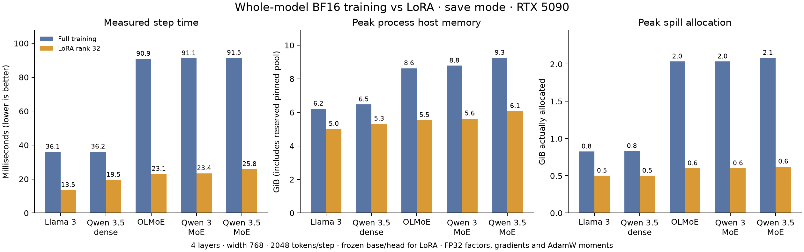

# Full-model LoRA validation and performance

## Result

LoRA trains end to end through ShadowSpill save and recompute on five architectures: Llama 3, dense Qwen 3.5, OLMoE, Qwen 3 MoE and Qwen 3.5 MoE. The PyTorch Llama/Qwen/OLMoE implementations also pass, giving eight implementations. These checks run on one RTX 5090 on Chicago.

- **32 GPU/reference correctness cases passed:** eight implementations × FP32/BF16 × save/recompute, three SGD updates each, nonzero B factors and output-head LoRA.
- Frozen parameters remain **bitwise unchanged**. Tight FP32 tests compare losses, all trainable gradients and updated state; BF16 checks also measure the relative error of parameter updates.
- Worst BF16 loss error: **0.065%**. Worst BF16 update-vector relative L2 error: **1.21%** versus the CPU reference. BF16 tolerances are stated in the harness; they differ from the tight FP32 checks.
- **28 performance cases passed**, including full-vs-LoRA across all five architectures, 1.18B Llama, and optional head LoRA.
- **28 saved-program optimizer audits passed:** optimizer parameter inputs, FP32 gradient inputs and AdamW state exactly match the trainable parameter inventory. Frozen weights have no optimizer gradient or moment allocation.

Correctness uses synthetic tokens and repeated updates, and establishes numerical implementation parity rather than downstream fine-tuning quality. [Case index](correctness.json), [optimizer audit](optimizer-audit.json).

## Architecture comparison

Four-layer models, width 768, vocabulary 32768, 2048 tokens per step, sequence length 512. MoE variants use E=32, K=4, H=512. These preserve the architecture but are **not** full published 30B/35B model sizes. BF16 base/compute; rank/alpha 32; FP32 factors, gradients and AdamW moments; no masters. Head/router/norm/shared expert frozen by default.

| Architecture | Variant | Full step ms | LoRA step ms | Speedup | Full → LoRA peak host RSS GiB |
|---|---|---:|---:|---:|---:|
| Llama 3 | save | 36.08 | 13.55 | 2.66× | 6.22 → 5.01 |
| Llama 3 | recompute | 33.91 | 14.58 | 2.33× | 6.22 → 5.02 |
| Qwen 3.5 dense | save | 36.15 | 19.52 | 1.85× | 6.47 → 5.32 |
| Qwen 3.5 dense | recompute | 35.36 | 21.27 | 1.66× | 6.57 → 5.33 |
| OLMoE | save | 90.85 | 23.07 | 3.94× | 8.62 → 5.53 |
| OLMoE | recompute | 87.33 | 26.29 | 3.32× | 8.78 → 5.53 |
| Qwen 3 MoE | save | 91.14 | 23.42 | 3.89× | 8.78 → 5.63 |
| Qwen 3 MoE | recompute | 87.92 | 26.54 | 3.31× | 8.78 → 5.61 |
| Qwen 3.5 MoE | save | 91.45 | 25.84 | 3.54× | 9.25 → 6.08 |
| Qwen 3.5 MoE | recompute | 90.63 | 29.83 | 3.04× | 9.24 → 6.08 |



These are medians of ten steps after at least five exact-step warmups and one second at LR=0. The full table also records sampled process-tree PSS, reserved spill capacity and actual spill allocation: [comparison and all graphpairs](COMPARISONS.md), [CSV](comparison.csv).

## 1.18B Llama scale check

12 layers, D=2048, FFN=7168, vocabulary 128256, 2048 tokens/step, 512-token sequences. A 16 GiB physical execution budget is identical across modes. LoRA trains 15.73M parameters, or 19.90M with head LoRA, compared with 1179.70M under full training.

| Mode | Variant | Median step ms | Aggregate tok/s | Peak host RSS GiB | Peak spill allocation GiB |
|---|---|---:|---:|---:|---:|
| Full | save | 517.30 | 3,943 | 27.22 | 11.98 |
| Full | recompute | 540.57 | 3,782 | 27.19 | 11.98 |
| LoRA; head frozen | save | 99.60 | 20,558 | 10.18 | 2.47 |
| LoRA; head frozen | recompute | 122.18 | 16,750 | 10.19 | 2.47 |
| LoRA including head | save | 101.39 | 20,194 | 10.33 | 2.51 |
| LoRA including head | recompute | 125.33 | 16,330 | 10.32 | 2.51 |

Full training uses ten measured steps; LoRA rows use the longer 40-step follow-up after at least ten warmups and two seconds. GC remains enabled. Save-mode LoRA ranges 99.03–100.78 ms; recompute ranges 121.77–123.72 ms. An observed 232 ms generation-2 collection during warmup supports startup GC as the likely explanation for isolated stalls in the earlier ten-step runs. [Timing evidence](TIMING.md).

Host RSS includes the pinned spill reservation. The same state-size formula selected 22 GiB for full training and 6 GiB for LoRA; those reservations are separate from the **11.98 → 2.47 GiB** measured peak spill allocation. RSS also includes initialization, Python/compiler state and ordinary CPU tensors. [Original scale comparison](SCALE_COMPARISONS.md).

### A repeated Llama block: individual graphpairs

Sizes are MiB. Mutated object size is zero in these functional forward/backward graphs; optimizer mutations are audited separately. Totals are per task, not sums of simultaneously live model memory. Full training has twelve occurrences; the LoRA repeated block has eleven because its first block is grouped with the frozen embedding.

| Mode | Variant | Pass | Input | Mutated | Output | Workspace | Total | Runtime ms |
|---|---|---|---:|---:|---:|---:|---:|---:|
| full | save | forward | 112.52 | 0.00 | 92.12 | 28.00 | 232.65 | 1.239 |
| full | save | backward | 204.65 | 0.00 | 216.02 | 164.16 | 584.82 | 2.747 |
| full | recompute | forward | 112.52 | 0.00 | 8.00 | 84.00 | 204.52 | 1.239 |
| full | recompute | backward | 120.52 | 0.00 | 216.02 | 212.14 | 548.68 | 3.625 |
| lora | save | forward | 117.52 | 0.00 | 95.50 | 28.00 | 241.02 | 1.409 |
| lora | save | backward | 208.02 | 0.00 | 13.00 | 108.02 | 329.04 | 2.058 |
| lora | recompute | forward | 117.52 | 0.00 | 8.00 | 92.00 | 217.52 | 1.412 |
| lora | recompute | backward | 125.52 | 0.00 | 13.00 | 186.83 | 325.35 | 3.065 |

The large saving is in backward gradient outputs and optimizer state. Frozen weights remain inputs; low-rank projections add some forward work and saved activations. In the repeated block, save-mode forward rises 1.239 → 1.409 ms, backward falls 2.747 → 2.058 ms. The much larger whole-step speedup also reflects reduced optimizer work and host/device state traffic.

## Efficiency checks

- Dense projections compute the small A/B products directly; they never form a full-sized weight delta.
- Routed expert products use grouped GPU kernels, with no Python loop launching a GEMM per expert. Frozen base projections compute needed input gradients and omit weight-gradient GEMMs.
- The bounded head loss omits frozen head gradients. Adding head LoRA costs about 1.8 ms in the 1B save measurement while retaining the memory savings.
- A separate explicit `addmm` epilogue probe showed no consistent gain (about ±2%, identical numerical outputs), so the simpler dense expression is retained. [Probe](evidence/dense-epilogue.json).
- No FP32 copy of frozen BF16 weights or master parameter is introduced by LoRA. Optimizer states belong only to selected trainable tensors.

## Fixes and checks

Whole-model tests found and fixed two generic ShadowSpill storage bugs: shared activation cotangents now receive independent boundary storage when required, and zero-element views retain accounting for their nonempty backing allocations. Neither fix depends on an MoE or LoRA operator name.

MLOps grouped GEMM tile selection now respects device shared-memory limits and narrow low-rank dimensions, and FP32 kernels respect the requested matmul precision. Existing MoE auxiliary routing counts now remain FP32 when the global default dtype is BF16/FP16.

Focused validation includes 119 MLOps GPU/registration checks, 80 MLOps CPU checks, 35 storage checks, 112 workload/documentation checks, and eight BF16 text-recipe initialization/backward checks. Counts are separate runs and are not an additive unique-test count.

Qualification is **green**: suite **1238 passed, 1 skipped**, CTest **20/20 and 51/51**, numerical **5/5 against existing references**, without regenerating references. See the [qualification log](logs/qualification.log).

## Reproduction and artifacts

Primary evidence and complete build stores are on Chicago:

```text
/home/shein/Documents/grad_school/research/shadowspill/docs/internal/plans/lora_models_1008/
```

From the Chicago checkout and its shadowspill environment, run [scripts/run_full_lora_sweep.py](scripts/run_full_lora_sweep.py) with `--suite benchmark --resume --outdir PATH`. `--suite scale` selects the 1.18B comparison. [full_model_lora.py](scripts/full_model_lora.py) accepts CLI options or `--config FILE.json`; each case saves config, parameters, graphpairs, timings, memory and the full build artifact store. Use the supplied shell launchers for the recorded environment and visible tmux execution.

[Source hashes and environment](source-manifest.json) · [Agenda](AGENDA.md) · [Other observations](OBSERVATIONS.md). Small reports and evidence are mirrored on Della under the same relative plan directory; full build stores remain on Chicago.

## Scope and review status

This validates single-GPU full-model FP32/BF16 LoRA. Whole-model EP conversion and full-model FP8 LoRA are not included; the existing QuackMoELoRA/TEMoELoRA modules remain separate. Published 30B/35B sizes and long-run fine-tuning quality are not claimed by these reduced-model checks.

The user approved committing and pushing the validated implementation. [Commit and synchronization record](SYNC.md). The scripts group changes by purpose: [MLOps](scripts/commit_mlops.sh), [ShadowSpill](scripts/commit_shadowspill.sh). These scripts record the approved source commit groups.

## Default 7B–9B model follow-up

The full-size performance-gate comparison is complete: [step throughput, memory and graphpairs](PERF_SCALE.md). It uses the gate's 64K-token steps, default microbatch geometries and BF16 gradients/moments. These differ from the earlier 2K-token/FP32-gradient experiments above; compare full training and LoRA within each matched experiment.
